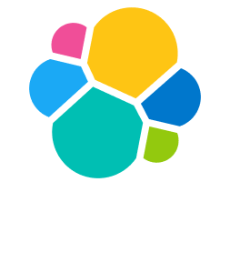
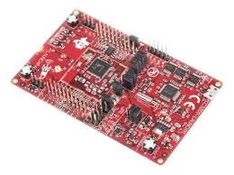
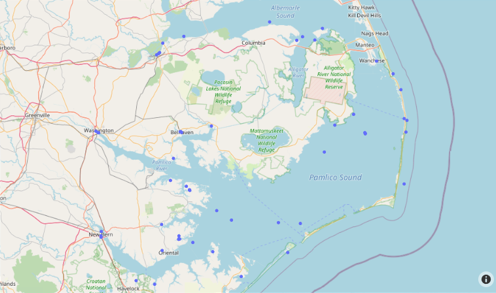

<body>

  <link rel="stylesheet" href="https://cdnjs.cloudflare.com/ajax/libs/font-awesome/4.7.0/css/font-awesome.min.css">
  <link rel="stylesheet" href="https://fonts.googleapis.com/css?family=Audiowide">
  <a class="underline" href="#">Software Design</a>
  <a class="underline" href="#">Data Structures and Algorithms</a>
  <a class="underline" href="#">Database Management</a>
  <a class="box" href="#">Contact</a>
  <a href="javascript:void(0);" class="icon" onclick="myFunction()">
    <i class="fa fa-bars fa-2x"></i>
  </a>

	

		

			

			Aaron Walls
				

					Software Engineer &
					Software Engineer &
					Software Engineer &
				

				

					Cyber Security Analyst
					Cyber Security Analyst
					Cyber Security Analyst
				

				Updated on December 2, 2021
			

			
	
			

		

	

	

		
		<h2>About Me:</h2>
		

		I am currently employed as a Cyber Security Analyst for the United States Air Force. It is as cool as it sounds, but it isn't my only skill set. 
		Computer technology is a passion of mine, and soon I'll earn my software engineering degree (End of December 2021). I started coding in Java when 
		I was 13, and have been learning and using development skills ever since. I began my professional career in computer technology as <i>the</i> IT guy and
		used my coding skills to create administrative scripts in powershell, bash, and python. After 3 years of IT support, I moved into the cyber security realm. 
		Around the sametime, I enrolled into college to persue my original passion: Software Development. Working full-time and attending school online as a full-time 
		student never felt overwhelming because the content of the work were very closely related. 

		

		This portfolio highlights some of the skills gained as a cyber security professional, and demonstrates projects I have completed as apart of my course work.
		

	

	

		<h2>Skills: </h2>
		

			

				
			

			

				

			

			
4 years

		

		

			

				
			

			

				

			

			
4 years

		

		

			

				
			

			

				

			

			
4 years

		

		

			

				
			

			

				

			

			
several years

		

		

			

				
			

			

				

			

			
3 years

		

		

			

				
			

			

				

			

			
3 years

		

		

			

				
			

			

				

			

			
1 year

		

		<h2>Platforms</h2>
		

			

				
			

			

				

			

			
1 year

		

		

			

				
			

			

				

			

			
1 year

		

		

			

				
			

			

				

			

			
1 year

		

	

	

		

			Software Design
			
		

		

			

				FEATURING CC3200 LAUNCH PAD
				
				
Exploring "Internet of things" development in C

			

		

		

			
			Software Design
		

	

	

		

			

				What's Inside?
			

			

			The GPIOinterrupt.c is a thermostat application written in C for the TI SimpleLink Wi-Fi CC3220s
			launch pad designed by Texas Instruments. It is a thermostat designed to display the current temperature,
			a specific set point, and turn on a red light if the set point is higher than the current temperature.
			The set point can be manipulated by the user when they press two buttons: one for adjusting the temperature
			up 1, and one for adjusting the temperature down 1. This program was designed to showcase a state machine.
			It emphasizes the separation between actions and transitions. 
				<ul class="features">Features:
					<li>Well defined states and transitions</li>
					<li>Handles multiple interrupts with custom callbacks</li>
					<li>Developed using SEI CERT C Coding Standards</li>
				</ul>
			

		

		

		

		

			
		

	

	

		

			Algorithms and Data Structures
			
		

		

			

				
			

		

		

			
			Algorithms and Data Structures
		

	

	

		

			Algorithms and Data Structures
			
		

		

		

		

			
			Algorithms and Data Structures
		

	

	

		

			Databases
			
		

		

			

				FEATURING Plotly, Mongo DB, and DASH
				
				
Exploring database functions in Python

			

		

		

			
			Databases
		

	

	

		

			

				What's Inside?
			

			

			The “Shipwreck Locations” application is a python application that retrieves data from a Mongo 
			Database. It uses Plotly, Dash, and Mapbox to display where the shipwrecks are according to 
			the latitude and longitude queried. Users can filter which shipwrecks are displayed by the 
			“watlev” value contained in the database. 
				<ul class="features">Features:
					<li>Create, Read, Update, and Delete database functions</li>
					<li>Display geographic data by their location on a map</li>
					<li>Protected against common SQL injection attacks through parameterization</li>
				</ul>
			

			

		

	

</body>
