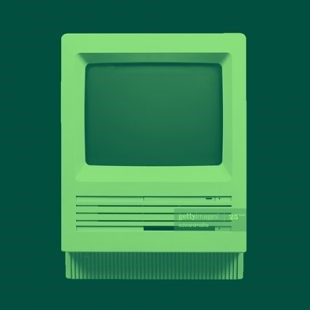

<body>

  <link rel="stylesheet" href="https://cdnjs.cloudflare.com/ajax/libs/font-awesome/4.7.0/css/font-awesome.min.css">
  <a href="javascript:void(0);" class="icon" onclick="myFunction()">
    <i class="fa fa-bars fa-2x"></i>
  </a>
  <a class="underline" href="#">Software Design</a>
  <a class="underline" href="#">Data Structures and Algorithms</a>
  <a class="underline" href="#">Database Management</a>
  <a class="box" href="#">Contact</a>

  

	
	

	Software Development
	<ul class="Sigline">
		<li>By Aaron J Walls</li>
		<li>Nov 23, 2021</li>
	</ul>
	

  

</body>
